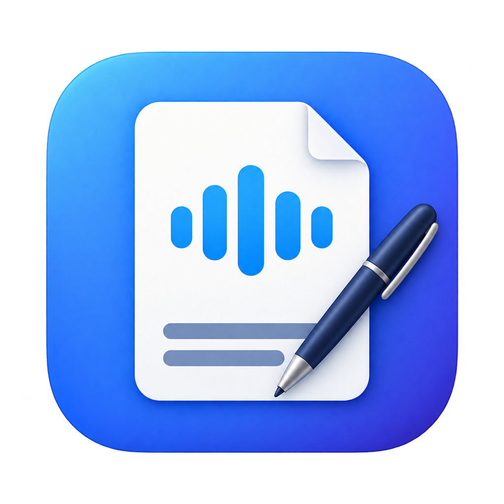

<p align="center">
  
</p>

<h1 align="center">Meeting Assistant</h1>

<p align="center">Live bilingual captions, translated speech, and meeting notes for macOS.</p>

<p align="center">
  <strong>English</strong> · <a href="README.zh-CN.md">简体中文</a>
</p>

<p align="center">
  
  
  <a href="LICENSE"></a>
  
</p>

A native SwiftUI app that captures your microphone and system audio, shows live captions with translations, and turns the saved transcript into a summary with references. Bring your own OpenAI API key; no developer-hosted backend is required.

> **Project status:** prototype, source version **0.1.17 (19)**. Offline checks pass, while fresh-machine installation and real remote-listener acceptance remain work in progress. The app interface is currently primarily Simplified Chinese; this README is available in both languages.

## Features

- **Live bilingual captions** — original speech and translation together, with automatic scrolling you can pause to review earlier text.
- **See-through floating captions** — during a meeting, captions float above Zoom, Meet, or Teams (including full screen) on an adjustable translucent background, so faces and shared screens stay visible. Drag, resize, or turn on click-through so clicks reach the meeting window.
- **Two audio sources** — microphone and system audio are recorded separately on a shared timeline.
- **Translated speech** — send AI-generated speech to a meeting through a virtual audio device, with automatic system-input switching and restoration.
- **Transcript-based summaries** — summarize the live text already received, with references back to the transcript and an automatic topic-based meeting title. Manual titles are retained; failures preserve the existing title, notes, and source text.
- **Local meeting library** — keep recordings and transcripts on your Mac, export Markdown, and delete individual meetings.
- **Your own credentials** — API keys are saved in macOS Keychain. There are no shared keys or analytics services.

## Quick start

### Requirements

| Requirement | Details |
| --- | --- |
| macOS | 14.2 or later; Apple silicon is the current development target. Intel has not been validated. |
| Build tools | Xcode or Command Line Tools with Swift 5.10+ and a compatible macOS SDK. Some optional developer scripts also use Python 3. |
| OpenAI | Your own API key and access to the models configured in the source. API usage is billed to your account. |
| Translated speech | A virtual audio device such as [BlackHole 2ch](https://existential.audio/blackhole/). It is not required just to record or display captions. |

The app uses `gpt-realtime-translate` with `gpt-live-transcribe` for live captions, `gpt-live-1` with a user-selected fixed voice (default `marin`) for outgoing interpreted speech, and `gpt-5.6-luna` for summaries. API access and connectivity are required; this is not an offline transcription model.

### Build from source

Signed and notarized Apple silicon builds are available from [GitHub Releases](https://github.com/shanrichard/MeetingAssistant/releases/latest).

```sh
git clone https://github.com/shanrichard/MeetingAssistant.git
cd MeetingAssistant
export CLANG_MODULE_CACHE_PATH="$PWD/.build/ModuleCache"
bash scripts/build-app.sh
open dist/MeetingAssistant.app
```

There are no third-party Swift package dependencies. The build script creates a local development signing identity when `MEETING_SIGNING_IDENTITY` is unset. Its signing material stays under `~/Library/Application Support/MeetingAssistant/DevelopmentSigning/`; a development build is not a notarized distribution package.

If the compiler reports an incompatible SDK, select a matching Xcode/Command Line Tools installation or set `SDKROOT` to an installed compatible SDK. The scripts use `--disable-sandbox` for SwiftPM's build-plugin sandbox; this does not disable macOS security settings.

**Google Calendar (optional)**: calendar features use your organization's own Google OAuth desktop client; none ships with this repository. A GCP administrator enables the Google Calendar API in a project under the organization, sets the OAuth consent screen to Internal, creates a "Desktop app" client, and writes its `client_id` and `client_secret` to the untracked `Config/google-oauth-client.json` (or points `MEETING_GOOGLE_OAUTH_CLIENT` at the JSON downloaded from Google Cloud). `build-app.sh` injects it before signing; builds without the file hide calendar features.

### Start a meeting

1. Open Settings, enter your OpenAI API key, choose **Save**, then verify the connection. In an organization build, connect your work Google account from **Coming up** in the sidebar (or **Settings → Google Account**); the sidebar then lists the next 7 days of meetings, and meetings about to start appear at the top of the main window and start with the calendar event linked.
2. Select a physical microphone, the caption/summary language, and the language you want to speak to others.
3. Start a meeting and grant the requested microphone and system-audio permissions. Headphones are recommended.
4. Floating captions appear above your meeting window. Hover to show controls for pause, translated speech, font size, background opacity, and click-through. Move the pointer onto the lock in the top-right corner to turn click-through off. **⇧⌘T** shows or hides the captions; defaults are under **Settings → 悬浮字幕**.
5. End the meeting to save the live transcript and recordings, then generate a summary and a concise topic-based title from the transcript. Manually chosen titles are retained. You can retry a failed summary later.

## Send translated speech

The app detects an existing BlackHole 2ch device. If it is missing, the setup flow can download the official installer after you choose to proceed. The download is checked against a pinned SHA-256, publisher signature, and Gatekeeper before macOS Installer opens. Installation may require administrator authorization and a restart.

1. Select the virtual device as the app's translated-audio output.
2. Configure the meeting app to follow the **system default microphone**. A fixed device selection will not follow automatic switching.
3. Open the **同传声音** tab in Settings to preview all 13 voices (default Marin). Each has a bundled GPT-Live bilingual clip: no network, API key, or API charge is needed to listen. Previewing does not change your selection; click **选用** to save it. Then enable **Send my translated speech**. Your choice is saved and stays fixed while sending; stop sending before changing it. Meeting Assistant keeps capturing the physical microphone while switching the system input to the virtual device.
4. Ask another participant to confirm what they hear. Stopping, pausing, ending, or quitting normally restores the original input; a later launch attempts recovery after an abnormal exit.

Previews play through your current physical headphones or speakers. Recording disables previews; switching clips or closing the picker stops playback.

The meeting app's mute control remains separate. Let participants know that the translated voice is AI-generated. Outgoing speech is translated by a separate GPT-Live session with a fixed voice; verify voice consistency, translation quality, and latency with your language pair before relying on it in a meeting. If interpreted audio fails, the virtual microphone stays silent until you explicitly restore the original microphone. Original-speech passthrough is not guaranteed.

[BlackHole](https://github.com/ExistentialAudio/BlackHole) is a separate project by Existential Audio Inc. Its installer is downloaded from the publisher and is not bundled in this repository; its own license applies.

## Privacy and data

| Data | Handling |
| --- | --- |
| API key | Stored in macOS Keychain; used to authenticate directly with the official OpenAI API. Not written into meeting records or exports. |
| Google authorization | Optional. Stored in macOS Keychain; used only to read your primary Google calendar directly. Not written into meeting records or exports. |
| Calendar link | Linked records keep the event title, scheduled time, organizer and invitees locally as context, not as proof of attendance. |
| Mail and briefs | Optional. With mail access, related threads (by invitees and meeting title) are read and sent with the invitation and earlier summaries to OpenAI to prepare pre-meeting briefs automatically; briefs are cached locally and deleted when Google is disconnected. Summaries compare against the brief. |
| Live audio | Saved locally and sent to OpenAI during active captioning/translation. |
| Saved recordings | Kept on your Mac; the post-meeting summary flow does not upload them for another transcription pass. |
| Summary input | Only the saved live transcript is sent to OpenAI. Empty or missing live text does not trigger an audio-upload fallback. |
| Markdown export | Text and time references; no audio files or credentials. |

Meeting files are stored in `~/Library/Application Support/MeetingAssistant/Meetings/`. The app connects directly to OpenAI (and Google Calendar when connected) without a shared proxy or telemetry backend. Deleting a meeting removes its local records and recordings; previously exported files remain separate.

## Development

Run the baseline offline checks from the project root:

```sh
export CLANG_MODULE_CACHE_PATH="$PWD/.build/ModuleCache"
swift run --disable-sandbox --build-system native MeetingCoreChecks
swift run --disable-sandbox --build-system native AudioSafetyChecks
bash scripts/check-voice-output.sh
bash scripts/check-blackhole-setup.sh
```

These commands use synthetic data or simulated dependencies and do not call OpenAI, capture a meeting, or change system audio routing. Additional hardware checks can play silent audio or temporarily switch devices: review the [validation guide (中文)](docs/验证记录.md) before running them.

| Path | Purpose |
| --- | --- |
| `Sources/MeetingAssistant/` | SwiftUI app, capture, devices, playback, and routing |
| `Sources/MeetingCore/` | Models, persistence, credentials, API clients, and transcript handling |
| `Sources/AudioSafety/` | Objective-C audio exception boundary |
| `Sources/MeetingDiagnostics/` | Optional online developer diagnostics; requires explicit API credentials |
| `Tests/` | Standalone regression programs and synthetic UI scenarios |
| `scripts/` | Build, signing, icon generation, and validation helpers |

See the [design overview (中文)](docs/方案.md), [validation guide (中文)](docs/验证记录.md), and [icon notes (中文)](docs/图标设计.md).

### Signing and distribution

Use your own Developer ID identity through `MEETING_SIGNING_IDENTITY` for distributable builds. Each package still needs notarization, Gatekeeper verification, and installation/upgrade testing. Local self-signed builds can require renewed Keychain authorization after a binary change.

Archive creation and cloud-signing instructions are in the [signing guide (中文)](docs/签名与分发.md). Signing credentials and certificates are not included in the repository.

## Known limitations

- Real remote-listener acceptance across Meet, Zoom, Teams, and Lark is still pending. Local playback counters do not prove that another participant heard translated speech.
- Only the two audio sources are distinguished; remote speakers are not individually identified.
- There is no dedicated acoustic echo cancellation for speaker playback. Use headphones.
- Captions missed during a connection failure are not reconstructed from recordings afterward.
- Fresh-machine setup, long sessions, device interruptions, the minimum macOS version, and Intel builds need further validation.

See the [acceptance checklist (中文)](docs/验证记录.md#待完成的实机验收) for the current testing scope.

## Contributing

Bug reports, documentation improvements, and focused pull requests are welcome. For larger changes, [open an issue](https://github.com/shanrichard/MeetingAssistant/issues) first to discuss the approach.

Include your macOS version, hardware, reproduction steps, and expected versus actual behavior. Run the relevant offline checks and describe any hardware or online testing separately. Keep the English and Chinese READMEs in sync. Use synthetic examples and redact logs; never attach API keys, signing material, private recordings, or meeting transcripts.

## License

Copyright 2026 shanrichard. Licensed under the [Apache License, Version 2.0](LICENSE). See [NOTICE](NOTICE) for attribution.
