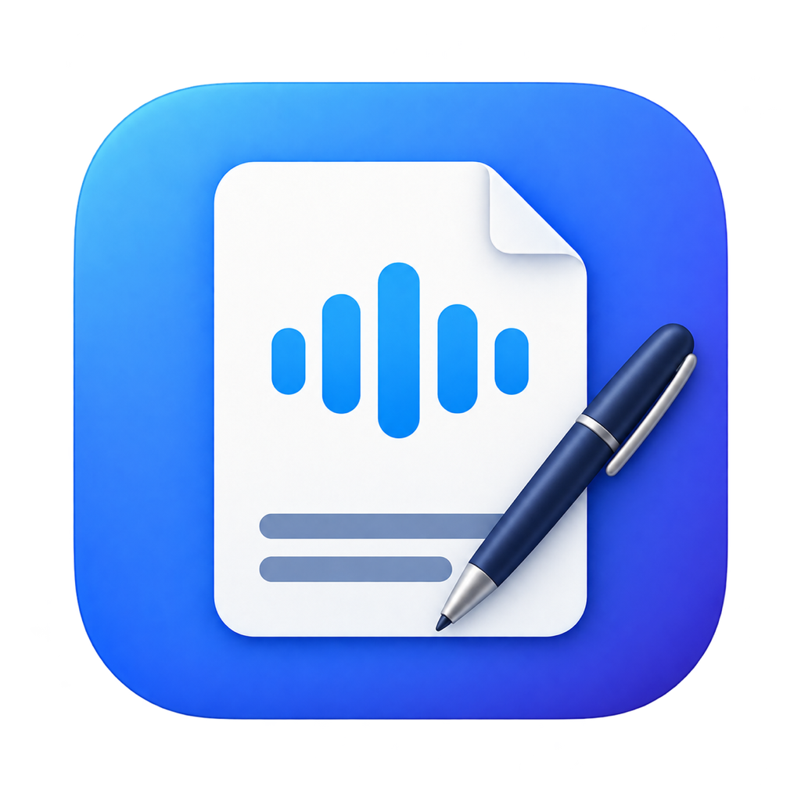

<p align="center">
  
</p>

<h1 align="center">Meeting Assistant</h1>

<p align="center">原生 macOS 会议助手：双语字幕、同传译音与会议记录。</p>

<p align="center">
  <a href="README.md">English</a> · <strong>简体中文</strong>
</p>

<p align="center">
  
  
  <a href="LICENSE"></a>
  
</p>

使用 SwiftUI 构建的原生应用，采集麦克风与系统音频，显示实时原文和译文，再基于已保存的原文生成带引用的会议总结。使用你自己的 OpenAI API Key，无需开发者托管的后端。

> **项目状态：** 原型阶段，当前源码版本 **0.1.12 (14)**。离线回归已通过，全新设备安装及真实会议对端听音仍待验收。应用界面目前以简体中文为主，本 README 提供中英文版本。

## 功能

- **实时双语字幕**：原文与译文一起显示，自动跟随新内容，手动上翻时暂停跟随。
- **双路音频采集**：麦克风与系统声音分别录制，共用时间轴。
- **同传译音**：通过虚拟音频设备向会议发送 AI 合成语音，自动切换并恢复系统麦克风。
- **基于原文的总结**：直接总结已经收到的实时文字，附带原文引用；失败时保留原文与已有总结。
- **本地会议库**：在 Mac 上保存录音与全文，支持 Markdown 导出和单场会议删除。
- **自己的凭据**：API Key 保存在 macOS 钥匙串，无共享 Key 或行为分析服务。

## 快速开始

### 环境要求

| 要求 | 说明 |
| --- | --- |
| macOS | 14.2 及以上；当前开发目标为 Apple Silicon，Intel 尚未验证。 |
| 构建工具 | Xcode 或 Command Line Tools，Swift 5.10+ 及兼容的 macOS SDK；部分可选开发脚本还需要 Python 3。 |
| OpenAI | 自己的 API Key，以及源码所配置模型的访问权限；API 费用由自己的账户承担。 |
| 同传译音 | [BlackHole 2ch](https://existential.audio/blackhole/) 等虚拟音频设备；仅录音和显示字幕不要求安装。 |

当前源码使用 `gpt-realtime-translate` 搭配 `gpt-live-transcribe` 处理实时音频，使用 `gpt-5.6-luna` 生成总结。需要网络和相应 API 权限，不是本地离线转写模型。

### 从源码构建

本仓库目前尚未提供预构建应用下载。

```sh
git clone https://github.com/shanrichard/MeetingAssistant.git
cd MeetingAssistant
export CLANG_MODULE_CACHE_PATH="$PWD/.build/ModuleCache"
bash scripts/build-app.sh
open dist/MeetingAssistant.app
```

项目没有第三方 Swift 包依赖。未设置 `MEETING_SIGNING_IDENTITY` 时，构建脚本会生成本地开发签名身份，签名材料保存在 `~/Library/Application Support/MeetingAssistant/DevelopmentSigning/`。开发构建不等于已公证的分发包。

如果编译器报告 SDK 不兼容，请选择配套的 Xcode / Command Line Tools，或用 `SDKROOT` 指定已安装的兼容 SDK。脚本中的 `--disable-sandbox` 只关闭 SwiftPM 构建插件子沙盒，不会关闭 macOS 安全设置。

### 开始会议

1. 打开设置，输入 OpenAI API Key，点击“保存”，再验证连接。
2. 选择真实麦克风、字幕与总结语言，以及向对方说的语言。
3. 开始新会议，允许麦克风和系统音频权限，建议戴上耳机。
4. 结束会议后保存实时原文与录音，再基于原文生成总结；失败时可稍后重试。

## 向会议发送译音

应用会检测已有的 BlackHole 2ch。缺少设备时，安装引导会在你选择继续后下载官方安装包，并核对固定 SHA-256、发布者签名和 Gatekeeper 结果，再打开 macOS 安装器。安装可能需要管理员授权与重启。

1. 在助手中选择虚拟设备作为译音输出。
2. 让会议软件使用**系统默认麦克风**；固定选择某个设备的软件不会跟随自动切换。
3. 开启“发送我的译音”。助手继续采集真实麦克风，同时将系统输入切换到虚拟设备。
4. 请另一位参会者确认实际听到的声音。停止、暂停、结束或正常退出时恢复原输入；异常退出后，下次启动会尝试恢复。

会议软件自身的静音控制仍然独立。请告知参会者译音为 AI 合成语音。已是目标语言的发言可能不输出译音，因此不保证目标语言原声透传。

[BlackHole](https://github.com/ExistentialAudio/BlackHole) 是 Existential Audio Inc. 的独立项目；安装包由发布者直接提供，不随本仓库分发，并适用其自身许可证。

## 隐私与数据

| 数据 | 处理方式 |
| --- | --- |
| API Key | 保存在 macOS 钥匙串，用于直接向 OpenAI 官方 API 认证；不写入会议记录或导出。 |
| 实时音频 | 本地保存，同时在字幕或翻译会话期间发送至 OpenAI。 |
| 已保存录音 | 保留在 Mac 上；会后总结不会再次上传录音重转写。 |
| 总结输入 | 仅发送已保存的实时原文；原文缺失或为空时不会回退到上传音频。 |
| Markdown 导出 | 仅文字和时间引用，不携带录音或凭据。 |

会议文件位于 `~/Library/Application Support/MeetingAssistant/Meetings/`。应用直接连接 OpenAI，无共享代理或遥测后端。删除会议会删除对应的本地记录和录音；已导出的文件独立保留。

## 开发

在项目根目录运行基础离线检查：

```sh
export CLANG_MODULE_CACHE_PATH="$PWD/.build/ModuleCache"
swift run --disable-sandbox --build-system native MeetingCoreChecks
swift run --disable-sandbox --build-system native AudioSafetyChecks
bash scripts/check-voice-output.sh
bash scripts/check-blackhole-setup.sh
```

以上命令使用合成数据或模拟依赖，不调用 OpenAI、不采集会议，也不改变系统音频路由。额外的硬件检查可能播放静音音频或临时切换设备，运行前请阅读 [验证与验收](docs/验证记录.md)。

| 目录 | 用途 |
| --- | --- |
| `Sources/MeetingAssistant/` | SwiftUI 应用、采集、设备、播放与路由 |
| `Sources/MeetingCore/` | 模型、持久化、凭据、API 客户端与字幕处理 |
| `Sources/AudioSafety/` | Objective-C 音频异常边界 |
| `Sources/MeetingDiagnostics/` | 可选的在线开发诊断，需要明确提供 API 凭据 |
| `Tests/` | 独立回归程序与合成 UI 场景 |
| `scripts/` | 构建、签名、图标生成与验证辅助脚本 |

进一步阅读：[设计方案](docs/方案.md)、[验证与验收](docs/验证记录.md)、[图标设计](docs/图标设计.md)。

### 签名与分发

通过 `MEETING_SIGNING_IDENTITY` 使用自己的 Developer ID 身份构建分发版本。每个分发包仍需完成公证、Gatekeeper 验证、安装与升级测试。本地自签名版本的二进制变化后，可能需要重新授权钥匙串访问。

归档与云端签名步骤见 [签名与分发](docs/签名与分发.md)。仓库不包含签名凭据或证书。

## 已知限制

- Meet、Zoom、Teams、Lark 的真实对端听音验收尚未完成；本地播放计数不能证明另一位参会者听到了译音。
- 只区分两路音频来源，不识别远端个人身份。
- 尚未实现针对外放的专用声学回声消除，建议使用耳机。
- 断网期间缺失的字幕不会在会后通过录音补全。
- 全新设备安装、长会议、设备中断、最低 macOS 版本和 Intel 构建仍需进一步验证。

具体范围见 [实机验收清单](docs/验证记录.md#待完成的实机验收)。

## 参与贡献

欢迎问题反馈、文档改进与范围明确的 Pull Request。较大的功能改动请先 [创建 Issue](https://github.com/shanrichard/MeetingAssistant/issues) 讨论方案。

反馈时请提供 macOS 版本、硬件、复现步骤、预期与实际行为。提交前运行相关离线检查，分别说明硬件或在线验证范围，并保持中英文 README 同步。请使用合成示例、脱敏日志，不要附带 API Key、签名材料、私人录音或会议原文。

## 许可证

Copyright 2026 shanrichard。采用 [Apache License 2.0](LICENSE)，版权说明见 [NOTICE](NOTICE)。
